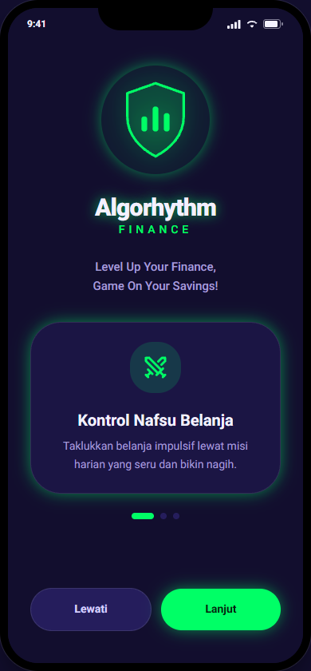
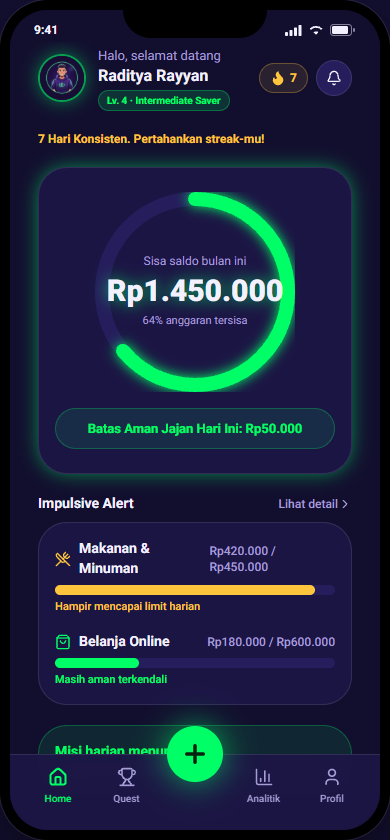
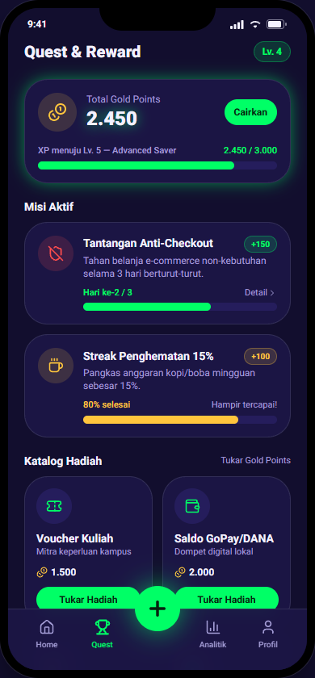
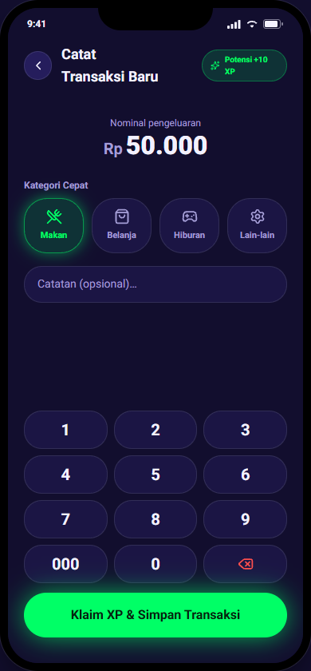
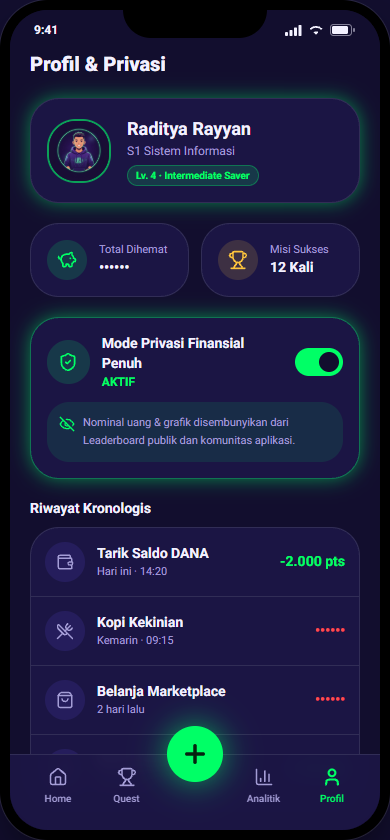
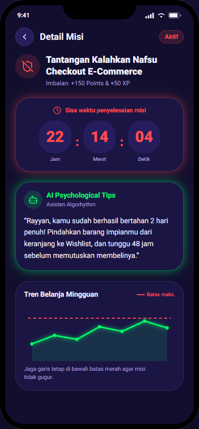
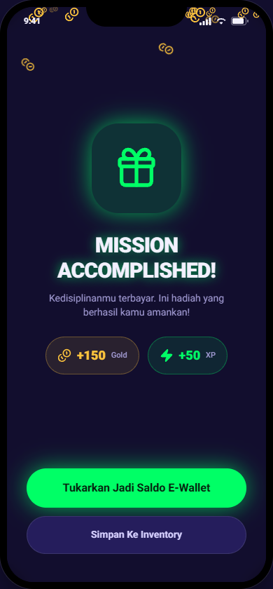
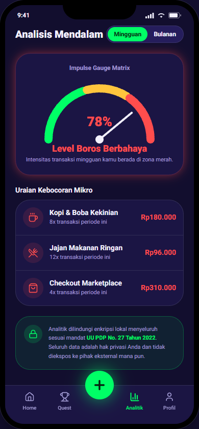
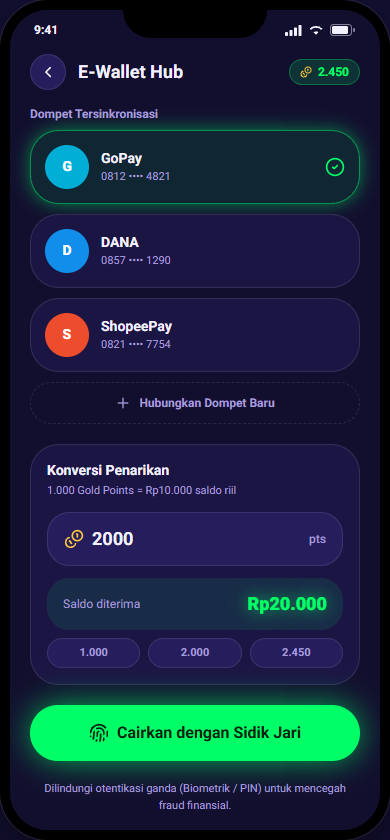

# Algorhythm Finance — UI Prototype Documentation

Selamat datang di repositori prototipe antarmuka (**UI Prototype**) **Algorhythm Finance**. Repositori ini berisi prototipe interaktif dengan **9 layar utama** yang mengusung tema gamifikasi keuangan personal untuk membantu pengguna (khususnya mahasiswa/anak muda) dalam melacak pengeluaran mereka dan menghindari pengeluaran impulsif.

Dokumen PDF portofolio lengkap dari cuplikan layar ini dapat diakses pada berkas:
📄 **[Algorhythm_Prototype_Screens.pdf](./Algorhythm_Prototype_Screens.pdf)**

---

## 🚀 Cara Menjalankan Aplikasi Secara Lokal

Aplikasi ini dibangun menggunakan **React (Next.js 16/Turbopack)** dan **Tailwind CSS**. Untuk menjalankannya di mesin lokal Anda:

1. **Instalasi Dependensi:**
   ```bash
   npm install
   ```
2. **Jalankan Server Pengembangan (Dev Server):**
   ```bash
   npm run dev
   ```
3. **Buka Browser:**
   Akses **[http://localhost:3000](http://localhost:3000)** untuk berinteraksi dengan prototipe. Gunakan tombol navigasi bawah (*Bottom Nav*), tombol pintas (*CTA*), atau menu samping pada kerangka ponsel untuk berpindah antar-layar.

---

## 📱 Daftar 9 Layar Prototipe & Deskripsi

Berikut adalah rincian lengkap dari ke-9 layar prototipe beserta *snapshot* tampilan terbarunya:

### 1. Onboarding Screen
* **File Komponen:** [`/components/algorhythm/screens/onboarding-screen.tsx`](./components/algorhythm/screens/onboarding-screen.tsx)
* **Deskripsi:** Layar pengenalan awal yang dirancang untuk menarik perhatian pengguna baru. Menggunakan perpaduan animasi *glow-green*, logo besar, dan tagline *"Level Up Your Finance, Game On Your Savings!"*. Layar ini dilengkapi slider komidi putar (*carousel*) interaktif dengan tiga fokus utama: Kontrol Nafsu Belanja, Jaga Daily Streak, dan Privasi 100% Aman.
* **Snapshot:**
  
  

---

### 2. Home Dashboard Screen
* **File Komponen:** [`/components/algorhythm/screens/home-screen.tsx`](./components/algorhythm/screens/home-screen.tsx)
* **Deskripsi:** Pusat informasi keuangan pengguna (dashboard) yang mengadopsi elemen game (gamifikasi). Menampilkan foto profil, nama pengguna (Raditya Rayyan), level akun (`Lv. 4 · Intermediate Saver`), indikator daily streak (7 hari), dan tombol notifikasi. Terdapat *Main Budget Card* dengan visualisasi persentase sisa anggaran bulanan berbentuk cincin progres melingkar (*Progress Ring*) dengan info sisa saldo (Rp1.450.000) dan rekomendasi jajan harian aman ("Batas Aman Jajan Hari Ini: Rp50.000").
* **Snapshot:**
  
  

---

### 3. Quest & Reward Screen
* **File Komponen:** [`/components/algorhythm/screens/quests-screen.tsx`](./components/algorhythm/screens/quests-screen.tsx)
* **Deskripsi:** Halaman utama untuk sistem misi (*quest*) dan penukaran hadiah (*reward store*). Menampilkan total poin emas terkumpul (2.450 pts) beserta *progress bar* XP menuju tingkat berikutnya (Lv. 5 - Advanced Saver). Berisi daftar kartu misi yang sedang berjalan beserta progresnya, contohnya *Tantangan Anti-Checkout* (hari ke-2 dari 3, bernilai +150 XP) dan *Streak Penghematan 15%* (progres 80%, bernilai +100 XP). Terdapat katalog hadiah penukaran poin (Voucher Kuliah, Saldo GoPay/DANA, Analitik Premium, dll.) lengkap dengan indikator kecukupan poin.
* **Snapshot:**
  
  

---

### 4. Catat Transaksi Screen
* **File Komponen:** [`/components/algorhythm/screens/transaction-screen.tsx`](./components/algorhythm/screens/transaction-screen.tsx)
* **Deskripsi:** Layar pengisian pengeluaran yang efisien dan interaktif. Menampilkan nominal transaksi berukuran besar dengan format rupiah otomatis. Memiliki pilihan ikon kategori pengeluaran instan (Makan, Belanja, Hiburan, Lain-lain), kolom catatan teks opsional untuk detail pengeluaran, serta papan tombol angka bawaan (*Custom Numpad*) di layar bawah untuk kemudahan pengisian secepat kalkulator. Tombol simpan menjanjikan imbalan instan ("Klaim XP & Simpan Transaksi — Potensi +10 XP") untuk memotivasi pencatatan.
* **Snapshot:**
  
  

---

### 5. Profil & Privasi Screen
* **File Komponen:** [`/components/algorhythm/screens/profile-screen.tsx`](./components/algorhythm/screens/profile-screen.tsx)
* **Deskripsi:** Halaman profil personal yang berfokus pada statistik pencapaian dan kontrol privasi ketat. Menampilkan identitas akademis/personal dan level pengguna saat ini. Memiliki kartu ringkasan "Total Dihemat" dan "Misi Sukses" (12 kali). Terdapat fitur sakelar (*switch*) "Mode Privasi Finansial Penuh" untuk menyembunyikan nominal saldo riil dan grafik keuangan (diganti dengan symbol `••••••`) dari papan peringkat publik (*leaderboard*) komunitas. Dilengkapi juga dengan daftar riwayat transaksi pengeluaran keuangan dan pencairan poin.
* **Snapshot:**
  
  

---

### 6. Detail Misi Screen
* **File Komponen:** [`/components/algorhythm/screens/quest-detail-screen.tsx`](./components/algorhythm/screens/quest-detail-screen.tsx)
* **Deskripsi:** Layar yang menyajikan informasi detail dan status terkini dari misi tertentu (misal: *Tantangan Kalahkan Nafsu Checkout E-Commerce*). Dilengkapi dengan *countdown timer* sisa waktu penyelesaian misi (Format Jam:Menit:Detik) untuk memicu rasa urgensi positif. Terdapat *AI Psychological Tips* (saran psikologis dinamis dari asisten virtual) untuk memandu perilaku pengguna agar berhasil menyelesaikan misi, serta *Trend Chart* (grafik tren garis belanja mingguan) dengan garis batas anggaran merah.
* **Snapshot:**
  
  

---

### 7. Klaim Hadiah Screen
* **File Komponen:** [`/components/algorhythm/screens/reward-claim-screen.tsx`](./components/algorhythm/screens/reward-claim-screen.tsx)
* **Deskripsi:** Layar perayaan (*Mission Accomplished*) bernuansa neon hijau yang muncul sesaat setelah misi diselesaikan atau setelah menyimpan transaksi hemat. Menampilkan efek animasi koin jatuh (*falling coins*) di latar belakang layar yang sedikit gelap (*backdrop blur*). Dilengkapi visualisasi jumlah poin/XP yang diraih (+150 Gold & +50 XP) dengan peti hadiah bercahaya. Pengguna dapat memilih untuk langsung mencairkan poin tersebut menjadi saldo E-Wallet atau menyimpannya ke inventori.
* **Snapshot:**
  
  

---

### 8. Analisis Mendalam Screen
* **File Komponen:** [`/components/algorhythm/screens/analytics-screen.tsx`](./components/algorhythm/screens/analytics-screen.tsx)
* **Deskripsi:** Layar untuk mendiagnosis pola belanja konsumtif pengguna secara periodik (Mingguan/Bulanan). Menampilkan *Impulse Gauge Matrix* berupa grafik *speedometer* tingkat keborosan pengguna yang terbagi dalam 3 warna (Aman/Hijau, Waspada/Kuning, Bahaya/Merah). Menyajikan pula *Uraian Kebocoran Mikro* untuk mendeteksi pengeluaran kecil berulang yang sering tidak disadari namun berdampak besar (misal: kopi & boba, jajan makanan ringan, belanja marketplace). Dilengkapi keterangan perlindungan privasi data sesuai UU PDP No. 27 Tahun 2022.
* **Snapshot:**
  
  

---

### 9. E-Wallet Hub Screen
* **File Komponen:** [`/components/algorhythm/screens/ewallet-screen.tsx`](./components/algorhythm/screens/ewallet-screen.tsx)
* **Deskripsi:** Layar integrasi dan pencairan dana poin menjadi saldo uang digital riil. Menampilkan daftar akun E-Wallet lokal yang terhubung (seperti GoPay, DANA, ShopeePay) dengan nomor telepon terenkripsi sebagian. Memiliki formulir input pengisian jumlah koin emas yang ingin dikonversi ke saldo rupiah (Rasio: 1.000 Gold Points = Rp10.000) dengan opsi nominal penarikan cepat (1.000, 2.000, 2.450). Tombol pencairan diintegrasikan dengan otentikasi sidik jari (*Fingerprint*) untuk keamanan ganda.
* **Snapshot:**
  
  

---

## 🛠️ Detail Teknologi & Gaya Desain
* **Frontend Framework:** Next.js (dengan direktori `/app` berbasis App Router).
* **Library UI & Icons:** Tailwind CSS v4, Lucide React Icons, Radix/Base UI components.
* **Fitur Utama:** 
  - Pengamanan data lokal berbasis regulasi **UU PDP No. 27 Tahun 2022**.
  - Gamifikasi keuangan (XP, Leveling, Gold Points, Streaks, Misi Harian).
  - Skrip ekspor PDF otomatis menggunakan Puppeteer headless browser.
